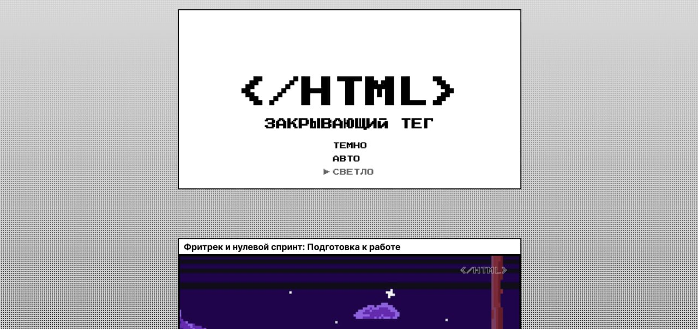

# Проект Закрывающий тег

### Технологии
  

### Содержание

[Описание](#description)  
[Команда проекта](#team)

<a name="description"><h3>Описание проекта</h3></a>
___

«Закрывающий тег» - финальный проект курса по повышению квалификации. Демонстрирует навыки кроссплатформенной семантической вёрстки, работы с анимацией и фильтрами.

Проект доступен по [ссылке](https://konstantin-leontyev.github.io/Zakrivayuschiy-teg/).

Особенности проекта: 
* Растровые изображения используются только для иллюстрации карточек, фавикона в формате ico и иконки для смартфона.
* На сайте адаптивный svg-фавикон. Стили прямо внутри него. Значение fill у кривых изменяется в зависимости от темы, установленной в операционной системе.
* На сайте фиксированное фоновое изображение, выполненное повторяющимся svg-паттерном.
* Стрелочка в меню, сердцем внутри карточки и кнопки анимированы.
* В реализации использован как инлайновый подход вставки SVG, так и подход через symbol + use. 

(<a href="#description">Вернуться в начало</a>)

<a name="team"><h3>Команда проекта</h3></a>
___

Верстка - Константин Леонтьев
